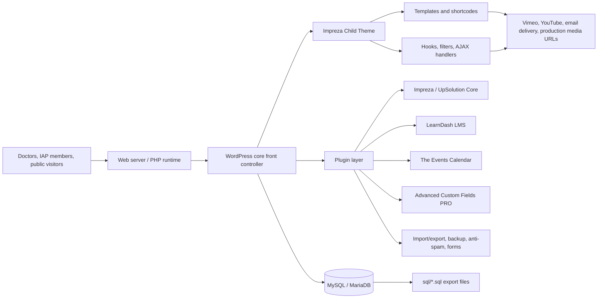
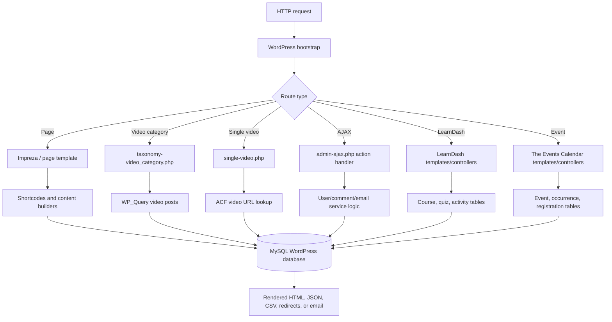
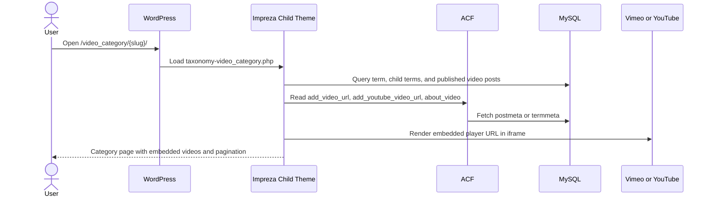
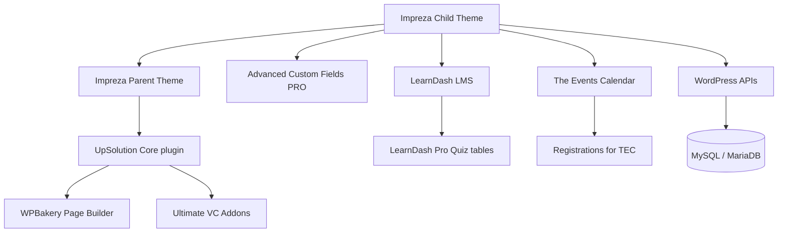
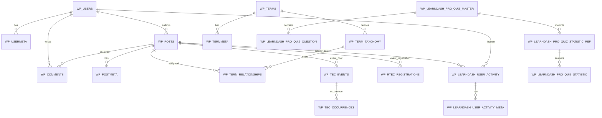
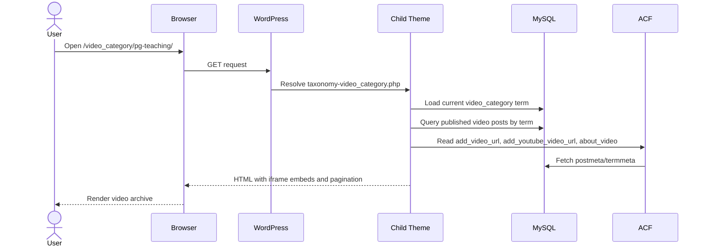
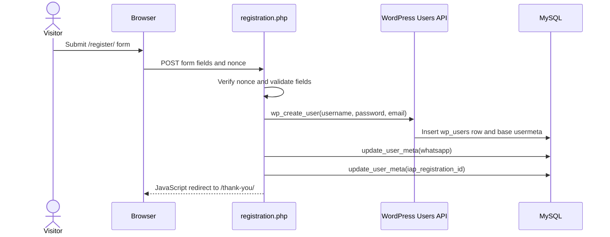
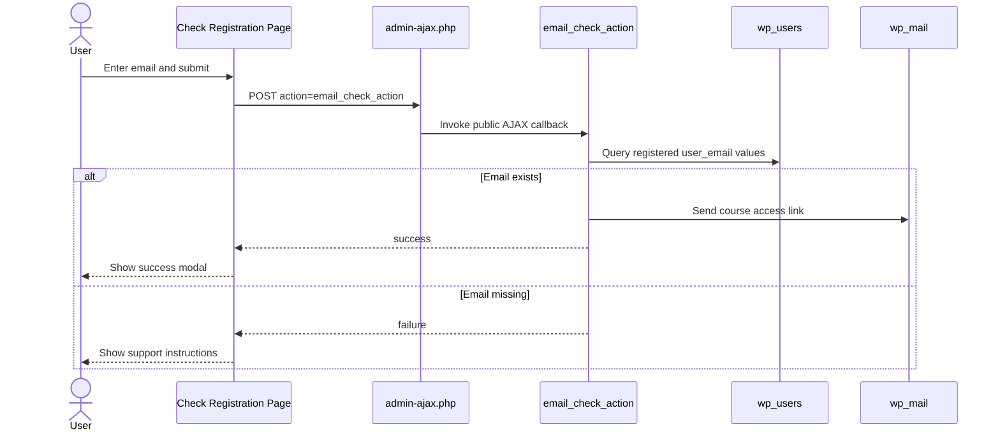
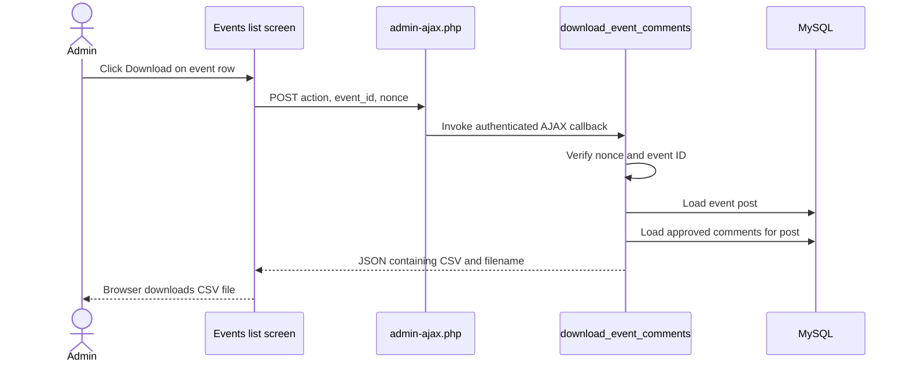
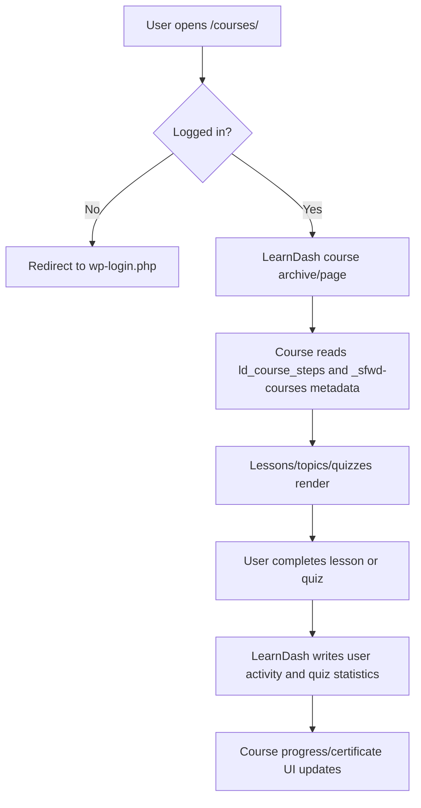

# dIAP WordPress Application

## Table of Contents

- [Product Overview](#product-overview)
- [System Architecture](#system-architecture)
- [Codebase Structure](#codebase-structure)
- [Core System Components](#core-system-components)
- [Database Design](#database-design)
- [Feature-Level Documentation](#feature-level-documentation)
- [API / Service Layer](#api--service-layer)
- [Application Flow](#application-flow)
- [Developer Onboarding Guide](#developer-onboarding-guide)
- [AI-Optimized System Summary](#ai-optimized-system-summary)

## Product Overview

This repository is the source and database export for `diapindia.org.in`, a WordPress-based education portal for the Indian Academy of Pediatrics digital IAP ecosystem. The application combines a public content site, a protected medical video archive, event calendar workflows, LearnDash courses, quizzes, certificates, member registration, and administrative import/export tooling.

### What the System Does

The system provides pediatricians and IAP-associated users with:

- A large searchable library of medical education videos grouped by custom video categories.
- LearnDash LMS courses with lessons, topics, quizzes, completion tracking, and certificates.
- IAP webinar/event calendars powered by The Events Calendar and event registration records.
- Public article, case study, mini-CME, and PDF/flipbook pages.
- A custom member registration flow that captures WhatsApp number and IAP Registration ID.
- A verification form that checks whether an email exists in WordPress users and emails a National Vaccinology Module access link.
- Admin workflows for downloading event comments as CSV and importing/exporting users/content.

### Problem It Solves

dIAP centralizes pediatric education materials that would otherwise be spread across live webinars, recordings, course modules, event pages, and downloadable publications. The WordPress content model lets non-developer administrators manage most content, while the child theme adds domain-specific behavior for IAP videos, member metadata, gated access, and reporting.

### Key Features

| Feature | Primary implementation | Data source |
| --- | --- | --- |
| Video archive | Custom `video` post type and `video_category` taxonomy in `wp-content/themes/Impreza-child/functions.php` | `wp_posts`, `wp_postmeta`, `wp_terms`, `wp_term_taxonomy`, `wp_term_relationships` |
| Video category pages | `wp-content/themes/Impreza-child/taxonomy-video_category.php` | ACF fields `add_video_url`, `add_youtube_video_url`, `about_video`, `category_image` |
| Single video page | `wp-content/themes/Impreza-child/single-video.php` | `video` posts and ACF video URL fields |
| LearnDash LMS | `wp-content/plugins/sfwd-lms` | `sfwd-courses`, `sfwd-lessons`, `sfwd-topic`, `sfwd-quiz`, `sfwd-question`, LearnDash tables |
| Events and webinars | `wp-content/plugins/the-events-calendar`, `wp-content/plugins/registrations-for-the-events-calendar` | `tribe_events`, `wp_tec_events`, `wp_tec_occurrences`, `wp_rtec_registrations` |
| Custom user registration | `wp-content/themes/Impreza-child/registration.php` | `wp_users`, `wp_usermeta` |
| Email verification/access-link workflow | `[email_check_form]` shortcode and `email_check_action` AJAX handler | `wp_users`, `wp_mail()` |
| Admin comment CSV download | `download_event_comments` AJAX handler | `wp_comments` |
| Visual page building | Impreza, UpSolution Core, WPBakery, Ultimate VC Addons | `page`, `us_header`, `us_page_block`, `us_content_template` posts |

### Target Users

- Pediatricians and doctors consuming webinar recordings, lectures, mini-CMEs, and course material.
- IAP members who need registration-linked access to courses and certificates.
- Site administrators who publish videos, manage courses, schedule events, moderate comments, and export user/event data.
- Developers or AI agents maintaining the WordPress theme, plugin stack, database, and custom workflows.

### High-Level User Journey

1. A visitor lands on the home page.
2. The Impreza header exposes search and category navigation.
3. The home page renders `[video_list]`, which shows major video categories, courses, and article/mini-CME entry points.
4. A user selects a video category and sees embedded Vimeo or YouTube recordings.
5. Protected routes such as search, selected video categories, and course archives redirect unauthenticated users to login.
6. A new user registers through `/register/`, where the child theme creates a WordPress user and stores `whatsapp` and `iap_registration_id` metadata.
7. Logged-in users access LearnDash courses, complete lessons/quizzes, and receive course progress/certificate data through LearnDash.
8. Administrators manage videos, courses, events, registrations, users, imports/exports, backups, and event comment downloads from WordPress admin.

## System Architecture

### Overall Architecture

The repository is a WordPress application bundle rather than a standalone framework application. WordPress core is expected from the runtime/host; this repository contains `wp-config.php`, `wp-content`, plugin source, theme source, and SQL table exports.

`meta.json` declares:

| Item | Value |
| --- | --- |
| Site URL | `http://diapindia.org.in` |
| WordPress version | `7.0` as declared by the export metadata |
| PHP version | `8.3.31` |
| Active theme | `Impreza-child`, parent `Impreza` |
| Database prefix | `wp_` |
| Timezone | `Asia/Kolkata` |

### Architecture Diagram



### Application Layers

| Layer | Responsibility | Repository locations |
| --- | --- | --- |
| Runtime | PHP, WordPress bootstrap, DB connection, salts, memory/debug settings | `wp-config.php` |
| Presentation | Page, archive, search, comment, video, registration templates | `wp-content/themes/Impreza-child/*.php`, `wp-content/themes/Impreza` |
| Theme framework | Header/footer builder, grids, shortcodes, theme options, widgets, CSS/JS assets | `wp-content/plugins/us-core`, `wp-content/themes/Impreza` |
| Domain customization | Video CPT, video taxonomy, access gates, user metadata, AJAX handlers | `wp-content/themes/Impreza-child/functions.php` |
| LMS | Courses, lessons, topics, quizzes, certificates, user activity | `wp-content/plugins/sfwd-lms`, `wp-content/plugins/learndash-*` |
| Events | Event posts, occurrences, registrations, calendar views | `wp-content/plugins/the-events-calendar`, `wp-content/plugins/registrations-for-the-events-calendar` |
| Data persistence | WordPress tables, LearnDash tables, event tables, plugin tables | `sql/*.sql` |
| Operations | Backup/restore, imports/exports, user CSV/XML tooling | `updraftplus`, `wp-all-import`, `wp-all-export`, user import/export plugins |

### Core Components

| Component | Purpose |
| --- | --- |
| WordPress core | Routing, posts/users/taxonomy APIs, admin, authentication, hooks, `admin-ajax.php`, comments, mail |
| Impreza parent theme | Base theme files and visual framework integration |
| Impreza child theme | Site-specific templates, CPT/taxonomy registration, access rules, shortcodes, user metadata, event CSV download |
| UpSolution Core | Impreza builder engine, custom post types such as `us_header`, `us_page_block`, `us_content_template`, grids, shortcodes, AJAX helpers |
| Advanced Custom Fields PRO | Custom video, category image, and descriptive fields |
| LearnDash LMS | Course/course-step/quiz model, progress tracking, certificates, advanced quiz tables |
| The Events Calendar | Event post type, event metadata, event occurrence tables, calendar pages |
| Registrations for The Events Calendar | Event registration table and admin workflows |

### Data Flow



### Component Interaction Diagram



## Codebase Structure

### Folder Structure

```text
.
├── meta.json
├── wp-config.php
├── sql/
│   ├── wp_posts.sql
│   ├── wp_postmeta.sql
│   ├── wp_users.sql
│   ├── wp_usermeta.sql
│   ├── wp_terms.sql
│   ├── wp_term_taxonomy.sql
│   ├── wp_term_relationships.sql
│   ├── wp_learndash_*.sql
│   ├── wp_tec_*.sql
│   ├── wp_rtec_registrations.sql
│   └── plugin-specific tables
└── wp-content/
    ├── index.php
    ├── mu-plugins/
    │   └── index.php
    ├── themes/
    │   ├── Impreza/
    │   ├── Impreza-child/
    │   └── twentytwentythree/
    └── plugins/
        ├── advanced-custom-fields-pro/
        ├── sfwd-lms/
        ├── learndash-certificate-builder/
        ├── the-events-calendar/
        ├── registrations-for-the-events-calendar/
        ├── us-core/
        ├── js_composer/
        ├── Ultimate_VC_Addons/
        ├── jetpack/
        ├── wp-all-import/
        ├── wp-all-export/
        └── other WordPress plugins
```

### Major Directory Purposes

| Path | Purpose |
| --- | --- |
| `meta.json` | Export metadata describing WordPress/PHP versions, site URL, installed plugins, and themes. |
| `wp-config.php` | WordPress configuration, table prefix, salts, `WP_MEMORY_LIMIT`, debug mode, and bootstrap include. |
| `sql/` | SQL table exports for WordPress core tables and plugin tables. This is the database snapshot and content source of truth. |
| `wp-content/themes/Impreza-child/` | Site-specific child theme. This is the main custom application code. |
| `wp-content/themes/Impreza/` | Parent commercial theme used by the child theme. |
| `wp-content/plugins/us-core/` | UpSolution/Impreza framework plugin for theme builders, grids, shortcodes, widgets, AJAX helpers, and integration glue. |
| `wp-content/plugins/sfwd-lms/` | LearnDash LMS plugin source. |
| `wp-content/plugins/the-events-calendar/` | Event post type, event query/model layer, calendar templates, and occurrence tables. |
| `wp-content/plugins/registrations-for-the-events-calendar/` | Event registration records and related admin functionality. |
| `wp-content/plugins/advanced-custom-fields-pro/` | ACF field definitions and field value API used by the child theme. |
| `wp-content/plugins/wp-all-import`, `wp-content/plugins/wp-all-export`, user import/export plugins | Bulk import/export and operational data movement. |
| `wp-content/mu-plugins/index.php` | Placeholder only. No custom must-use plugin logic is present. |

### Key Custom Modules and Files

| File | Purpose |
| --- | --- |
| `wp-content/themes/Impreza-child/functions.php` | Registers `video`, `video_category`, shortcodes, user metadata, login/access hooks, mail sender overrides, admin event comment CSV export, and AJAX handlers. |
| `wp-content/themes/Impreza-child/taxonomy-video_category.php` | Renders category archive pages for `video_category`, including parent/child category sections, embedded videos, ACF `about_video`, and pagination. |
| `wp-content/themes/Impreza-child/single-video.php` | Renders a single `video` post with a Vimeo iframe and post content. |
| `wp-content/themes/Impreza-child/registration.php` | Page template for custom registration. Creates WordPress users and stores `whatsapp` and `iap_registration_id`. |
| `wp-content/themes/Impreza-child/search.php` | Custom search page template focused on rendering matching video results with Vimeo embeds and `about_video`. |
| `wp-content/themes/Impreza-child/page.php` | Delegates normal pages to Impreza/UpSolution templates, with fallback comment rendering. |
| `wp-content/themes/Impreza-child/comments.php` | Minimal comment list/form template. |
| `wp-content/themes/Impreza-child/style.css` | Child theme metadata and small global CSS overrides. |

### Dependency Relationships



### Architectural Patterns Used

- WordPress hook/filter architecture: behavior is attached through `add_action()` and `add_filter()`.
- Template hierarchy overrides: child theme files override or augment WordPress/Impreza templates.
- Shortcode-driven composition: `[video_list]`, `[email_check_form]`, `[search_cat_form]`, and builder shortcodes render user-facing modules.
- Custom post types and taxonomies: `video`, `video_category`, LearnDash CPTs, event CPTs, Impreza builder CPTs, and legacy `course`.
- Entity-attribute-value metadata: WordPress stores most custom fields in `wp_postmeta`, `wp_usermeta`, and `wp_termmeta`.
- Plugin-owned bounded contexts: LearnDash, TEC, ACF, and UpSolution Core maintain their own tables, hooks, and admin workflows.
- `admin-ajax.php` service endpoints: custom and plugin AJAX actions serve form checks, comment CSV export, grids, contact forms, login, and LMS quiz interactions.

## Core System Components

### Controllers and Request Handlers

| Component | Purpose | Responsibilities | Key logic | Interactions |
| --- | --- | --- | --- | --- |
| WordPress front controller | Route all HTTP requests | Load theme template, plugin hooks, current query, auth state | Native WP rewrite/template resolution | All plugins and themes |
| `taxonomy-video_category.php` | Video category archive controller/template | Query videos by current `video_category`; render child categories; paginate parent category posts | Uses `WP_Query`, `get_queried_object()`, `get_term_children()`, `get_field()` | ACF, `wp_posts`, taxonomy tables, Vimeo/YouTube |
| `single-video.php` | Single video controller/template | Render title, content, and Vimeo embed for one `video` post | Reads `add_video_url` from ACF | ACF, `wp_postmeta` |
| `search.php` | Search results controller/template | Search posts and render matched items that have `add_video_url` | Uses `get_search_query()` and `WP_Query` | ACF, WordPress search |
| `registration.php` | Registration controller/template | Validate submitted registration form, create user, store user meta, redirect to thank-you page | Uses nonce, `wp_create_user()`, `update_user_meta()` | `wp_users`, `wp_usermeta` |
| `email_check_action()` | Public AJAX handler | Check if submitted email exists; send National Vaccinology Module link by email | Reads all user emails from `$wpdb->users`, sends `wp_mail()`, returns `success` or `failure` | `wp_users`, mail transport |
| `handle_download_event_comments()` | Admin AJAX handler | Generate CSV of approved comments for an event | Verifies nonce, reads `get_post()`, `get_comments()`, returns CSV content in JSON | `wp_comments`, admin event list |
| UpSolution Core AJAX handlers | Builder and frontend utilities | Grids, contact forms, login, user info, builder saves, media helpers | Registered under many `us_*` AJAX actions | Impreza templates, admin UI, WordPress mail/media |
| LearnDash/WP-Pro-Quiz handlers | LMS and quiz behavior | Course navigation, quiz completion, statistics, certificates | Plugin controllers and custom tables | LearnDash CPTs and tables |

### Services

| Service | Purpose | Responsibilities | Key logic | Interactions |
| --- | --- | --- | --- | --- |
| Video catalog service logic | Provide video listing and categorization | Register CPT/taxonomy, query categories, render category cards | `create_post_type_project()`, `themes_taxonomy_project()`, `get_all_video_list()` | ACF, taxonomy tables, WP templates |
| Access control service logic | Gate selected content to authenticated users | Redirect unauthenticated users away from search, course archive, and selected video categories | `redirect_to_login()`, `redirect_to_login_on_specific_page()`, `restrict_category_access()` | WordPress auth and login |
| User metadata service logic | Store IAP and phone metadata | Add admin profile fields, save metadata, register REST-visible meta | `add_mobile_number_field()`, `save_mobile_number_field()`, `register_meta()`, `diap_render_iap_field()`, `diap_save_iap_field()` | `wp_usermeta`, WP user profiles |
| Mail identity service logic | Normalize outgoing sender identity | Override `wp_mail_from_name` and `wp_mail_from` | Sender name `Diapindia`, sender email `centraloffice@iapindia.org` | All `wp_mail()` calls while filters are active |
| Login customization service logic | Simplify login UX | Hide default navigation, customize logo URL, replace error text, add registration/forgot-password links | `login_head`, `login_headerurl`, `login_errors`, `login_footer` hooks | `/wp-login.php` |
| Event admin reporting service logic | Download comments per event | Add admin list column, inject JavaScript, verify nonce, generate CSV | `manage_tribe_events_posts_columns`, `admin_footer`, `wp_ajax_download_event_comments` | The Events Calendar admin, comments |
| LearnDash LMS service layer | Course and quiz delivery | Manage course hierarchy, quiz questions, progress, certificates | LearnDash classes and WP-Pro-Quiz controllers | LearnDash CPTs/tables, user activity |
| Event calendar service layer | Events, occurrences, registration | Calendar routes, event metadata, occurrence caching, registrations | TEC plugin models and RTEC table | `tribe_events`, `wp_tec_*`, `wp_rtec_registrations` |

### Modules

| Module | Purpose |
| --- | --- |
| Child theme domain module | Site-specific PHP customizations in `functions.php`. |
| Template module | Custom PHP templates for registration, search, video archive, video single, pages, and comments. |
| ACF module | Field groups `Posts Video` and `Video Category`, stored as `acf-field-group` and `acf-field` posts. |
| LMS module | LearnDash course objects, lesson/topic/quiz/question CPTs, activity tables, certificates. |
| Events module | The Events Calendar CPTs/tables and registration plugin table. |
| Builder module | Impreza/UpSolution Core custom post types, Visual Composer/WPBakery shortcodes, grid/header/footer builders. |
| Import/export module | WP All Import/Export and user import/export plugins, with related `wp_pmxi_*`, `wp_pmxe_*`, `wp_wt_iew_*` tables. |
| Backup module | UpdraftPlus plugin source. |

### Utilities and Middleware

| Utility/middleware | Purpose | Notes |
| --- | --- | --- |
| `unset_url_field()` | Removes website URL from comment form fields | Duplicates behavior also provided by URL Field Remover plugin. |
| `remove_default_post_type()` | Hides default WordPress `post` type from public/admin interfaces | The database still has one auto-draft `post`. |
| `load_bootstrap_and_jquery()` | Enqueues Bootstrap 4.5 CSS/JS from CDN | `email_check_form_shortcode()` also includes jQuery 3.7.1 and Bootstrap 3.4.1 inline, so front-end dependency overlap exists. |
| `search_form()` shortcode | Renders a category dropdown and redirects on change | Uses `video_category` terms plus `/courses/`. |
| `custom_retrieve_password_message()` | Appends text to password reset emails | Works through `retrieve_password_message` filter. |
| `set_password_reset_flag()` and `redirect_after_password_reset()` | Redirect users home after first login following password reset | Uses `password_reset_flag` user meta. |
| `restrict_subscriber_access_to_admin()` | Prevents subscriber users from entering `wp-admin` | Runs on `admin_init`. |
| `add_post_type_support('tribe_events', 'comments')` | Enables comments for event posts | Supports event discussions and CSV export. |

## Database Design

The database is provided as SQL table exports in `sql/`. There are no application-managed migrations in the repository. WordPress and plugins own schema creation; the SQL files are a snapshot used to restore content and plugin state.

### Database Snapshot Highlights

| Metric | Count from SQL export |
| --- | ---: |
| Published `video` posts | 5,455 |
| Published events (`tribe_events`) | 1,079 |
| Published LearnDash courses (`sfwd-courses`) | 54 |
| Published LearnDash lessons (`sfwd-lessons`) | 368 |
| Published LearnDash quizzes (`sfwd-quiz`) | 63 |
| Published pages | 39 |
| Users | 37,876 |
| Event registrations | 1,303 |
| LearnDash user activity records | 4,663 |

### Primary Tables and Entities

| Table/group | Entity | Purpose |
| --- | --- | --- |
| `wp_posts` | Posts, pages, videos, events, courses, lessons, quizzes, questions, attachments, theme builder posts | Central content table. The `post_type` column distinguishes entities. |
| `wp_postmeta` | Post metadata | Stores ACF values, event dates, LearnDash course settings, thumbnails, builder metadata, and many plugin fields. |
| `wp_users` | Users | WordPress accounts. Most users are subscribers. |
| `wp_usermeta` | User metadata | Roles/capabilities, addresses, mobile data, WhatsApp, IAP registration ID, LearnDash progress, sessions. |
| `wp_terms`, `wp_term_taxonomy`, `wp_term_relationships`, `wp_termmeta` | Taxonomies | Video categories, event categories, nav menus, standard categories, term images/descriptions. |
| `wp_comments`, `wp_commentmeta` | Comments | Event/page/video comments. Used by admin CSV export. |
| `wp_learndash_user_activity`, `wp_learndash_user_activity_meta` | LearnDash activity | Course, lesson, topic, quiz, and access progress records. |
| `wp_learndash_pro_quiz_*` | LearnDash advanced quiz engine | Quiz definitions, questions, statistics, locks, categories, templates, toplists. |
| `wp_tec_events`, `wp_tec_occurrences` | The Events Calendar optimized tables | Event date/occurrence lookup and recurrence/materialized occurrence data. |
| `wp_rtec_registrations` | Event registrations | Registrant names, email, phone, event ID, status, custom data. |
| `wp_actionscheduler_*` | Action Scheduler | Background/scheduled action queue used by plugins. |
| `wp_pmxi_*`, `wp_pmxe_*` | WP All Import / Export | Import/export job definitions, mappings, histories, and post/image tracking. |
| `wp_aysquiz_*` | Quiz Maker / AYS quiz plugin data | Legacy quiz data and reports separate from LearnDash. |
| `wp_wt_iew_*` | User/customer import-export plugin | Import/export mapping templates and action history. |
| `wp_jetpack_sync_queue` | Jetpack sync | Jetpack event queue. |

### Content Types in `wp_posts`

| Post type | Purpose | Notable count/status |
| --- | --- | --- |
| `video` | Custom video archive posts | 5,455 published |
| `page` | WordPress pages | 39 published |
| `tribe_events` | Event/calendar entries | 1,079 published |
| `sfwd-courses` | LearnDash courses | 54 published, 1 draft |
| `sfwd-lessons` | LearnDash lessons | 368 published |
| `sfwd-topic` | LearnDash topics | 16 published, 1 trash |
| `sfwd-quiz` | LearnDash quizzes | 63 published |
| `sfwd-question` | LearnDash quiz questions | 333 published, 2 draft |
| `sfwd-certificates` | LearnDash certificates | 2 published |
| `course` | Legacy Custom Post Type Maker course | 5 published, 1 draft |
| `acf-field-group`, `acf-field` | ACF configuration | 2 field groups, 4 fields |
| `us_header`, `us_page_block`, `us_content_template` | Impreza builder objects | Header, footer block, content template |
| `attachment` | Media library metadata | 1,072 attachment records; uploaded media files are not present in this repository |

### Custom Taxonomies

| Taxonomy | Terms |
| --- | --- |
| `video_category` | Webinar Archives, Academic Pearls, PG Teaching, Intensive Care Teaching, Expert lectures, Parent Education Videos, IAP Courses, IAP Webinar Calendar, Academic Pearls 2023, Articles & Mini CME |
| `tribe_events_cat` | National Calendar, Regional Calender |
| `nav_menu` | Services, Menu 1 |
| `category` | WordPress categories, mostly legacy/unused for current video flow |

### Video Category Distribution

| `video_category` term | Slug | Published videos |
| --- | --- | ---: |
| Webinar Archives | `iap-webinars-and-clinics` | 3,662 |
| PG Teaching | `pg-teaching` | 736 |
| Expert lectures | `expert-lectures` | 618 |
| Academic Pearls | `academic-pearls` | 223 |
| Intensive Care Teaching | `intensive-care-teaching` | 129 |
| Parent Education Videos | `parent-education-videos` | 62 |
| Academic Pearls 2023 | `academic-pearls-2023` | 51 |
| IAP Webinar Calendar | `iap-webinar-calendar` | 1 |

### ACF Field Model

| Field group | Applies to | Fields |
| --- | --- | --- |
| `Posts Video` | Post type `video` | `add_video_url` text, `add_youtube_video_url` text, `about_video` WYSIWYG |
| `Video Category` | Taxonomy `video_category` | `category_image` image URL |

### User Metadata

Important user metadata keys:

| Key | Purpose |
| --- | --- |
| `wp_capabilities` | WordPress role assignment. Most users are `subscriber`. |
| `whatsapp` | Custom WhatsApp number captured by `/register/` and editable in admin profiles. |
| `iap_registration_id` | Custom IAP Registration ID, registered with `show_in_rest => true`. |
| `Address`, `City`, `State`, `Mobile`, `PinCode`, `Email` | Imported/member profile metadata from legacy or bulk import workflows. |
| `_sfwd-course_progress`, `_sfwd-quizzes`, `course_*_access_from`, `course_completed_*` | LearnDash progress and enrollment/completion data. |
| `session_tokens` | Active WordPress sessions. |

### ER Diagram



### Constraints and Indexes

- WordPress tables follow standard primary keys such as `wp_posts.ID`, `wp_users.ID`, `wp_terms.term_id`, `wp_comments.comment_ID`.
- `wp_options.option_name` is unique.
- `wp_posts` has indexes for slug, parent, author, and `post_type`/`post_status`/date queries.
- `wp_postmeta`, `wp_usermeta`, and `wp_termmeta` index object IDs and metadata keys.
- `wp_term_relationships` uses composite primary key `(object_id, term_taxonomy_id)`.
- `wp_tec_events.post_id` is unique, linking each optimized event row to a `tribe_events` post.
- `wp_tec_occurrences.hash` is unique and has lookup indexes for `(post_id, end_date, start_date)` and UTC equivalents.
- `wp_rtec_registrations.id` is unique and has indexes on `event_id` and `status`.
- LearnDash tables define primary keys for activity, activity meta, quiz definitions, statistic references, and quiz question stats.

## Feature-Level Documentation

### 1. Video Archive

**Purpose:** Provide structured access to a large library of pediatric webinar and teaching videos.

**User flow:**

1. User opens the home page or selects a category in the header dropdown.
2. `[video_list]` renders top-level category cards using selected `video_category` terms and ACF category images.
3. User opens `/video_category/{slug}/`.
4. `taxonomy-video_category.php` queries published `video` posts in that term.
5. The template embeds Vimeo when `add_video_url` exists, otherwise YouTube from `add_youtube_video_url`.
6. Optional `about_video` text is rendered below the embed.

**Backend logic:**

- `create_post_type_project()` registers public `video` posts with title, editor, thumbnail, custom fields, comments, and revisions.
- `themes_taxonomy_project()` registers hierarchical `video_category`.
- `get_all_video_list()` builds category cards and hard-coded links for webinars, articles/mini-CMEs, and `/courses/`.
- `taxonomy-video_category.php` paginates parent category videos at 20 per page and renders all child category videos.

**Data interactions:**

- Reads `wp_posts` where `post_type = 'video'`.
- Joins taxonomy data through `wp_term_relationships` and `wp_term_taxonomy`.
- Reads ACF values from `wp_postmeta` and `wp_termmeta`.

**Components involved:**

- `functions.php`
- `taxonomy-video_category.php`
- `single-video.php`
- ACF PRO
- Impreza/UpSolution Core for header/page frame

### 2. Search and Category Navigation

**Purpose:** Let users find video content and navigate major content categories.

**User flow:**

1. Header includes `[search_cat_form]` through an Impreza header HTML element.
2. User chooses a video category from the dropdown.
3. JavaScript redirects to the selected category link.
4. Search requests use the custom `search.php` template.

**Backend logic:**

- `search_form()` fetches top-level `video_category` terms ordered by ID descending.
- `search.php` performs a WordPress search and renders only results with `add_video_url`.
- `redirect_to_login()` redirects unauthenticated search users to WordPress login.

**Data interactions:**

- `get_terms()` for `video_category`.
- `WP_Query` with `s` search parameter.
- ACF `add_video_url` and `about_video`.

### 3. Custom User Registration and Profile Metadata

**Purpose:** Register doctors/IAP members with additional professional identifiers.

**User flow:**

1. User opens `/register/`, which uses `registration.php`.
2. User submits username, WhatsApp number, IAP Registration ID, email, password, and confirm password.
3. Template verifies nonce and validates required IAP ID and password match.
4. WordPress creates a user.
5. Theme stores `whatsapp` and `iap_registration_id` in `wp_usermeta`.
6. User is redirected to `/thank-you/`.

**Backend logic:**

- Uses `wp_nonce_field()` and `wp_verify_nonce()`.
- Uses `wp_create_user()` for account creation.
- Uses `update_user_meta()` for `whatsapp` and `iap_registration_id`.
- Adds admin profile fields for WhatsApp and IAP Registration ID.
- Registers `iap_registration_id` as user meta exposed through REST.

**Data interactions:**

- Writes to `wp_users`.
- Writes to `wp_usermeta`.

**Components involved:**

- `registration.php`
- `functions.php`
- WordPress users/admin profile APIs

### 4. Email Verification for National Vaccinology Module

**Purpose:** Let a user request a course access link if their email is already registered.

**User flow:**

1. User opens the page containing `[email_check_form]` (`/check-registration/` in the SQL export).
2. User enters an IAP registered email ID.
3. JavaScript sends `POST` to `admin-ajax.php` with `action=email_check_action`.
4. The handler checks whether the email exists in `wp_users.user_email`.
5. If found, the system sends an HTML email with the National Vaccinology Module link and shows a success modal.
6. If not found, the system shows a failure modal with helpdesk instructions.

**Backend logic:**

- Public and authenticated AJAX actions are registered.
- Email is sanitized with `sanitize_email()`.
- Existing emails are loaded from `$wpdb->users`.
- `wp_mail()` sends an HTML email.
- Response is plain text: `success` or `failure`.

**Data interactions:**

- Reads `wp_users.user_email`.
- Sends mail through WordPress mail infrastructure.

### 5. LearnDash Courses, Quizzes, and Certificates

**Purpose:** Deliver structured educational courses and track learner completion.

**User flow:**

1. User opens `/courses/` or a LearnDash course URL.
2. Unauthenticated users are redirected to login for the course archive.
3. Authenticated users access course pages.
4. LearnDash renders lessons, topics, quizzes, progress, and certificates.
5. Progress and quiz attempts are persisted to LearnDash user activity and quiz tables.

**Backend logic:**

- LearnDash owns `sfwd-courses`, `sfwd-lessons`, `sfwd-topic`, `sfwd-quiz`, `sfwd-question`, and `sfwd-certificates`.
- Course hierarchy is stored in post meta such as `ld_course_steps`, `_sfwd-courses`, `_sfwd-lessons`, and `_sfwd-quiz`.
- User progress is stored in `wp_learndash_user_activity`, `wp_learndash_user_activity_meta`, and user meta.

**Data interactions:**

- Reads/writes LearnDash CPTs in `wp_posts`.
- Reads/writes LearnDash metadata in `wp_postmeta`.
- Reads/writes activity and quiz statistics tables.

### 6. Events, Webinar Calendar, and Registrations

**Purpose:** Publish national/regional calendar events, collect registrations, and support event discussions.

**User flow:**

1. User opens the webinar calendar page or event route.
2. The Events Calendar renders event listings and event details.
3. Users register through Registrations for The Events Calendar.
4. Event comments are available because the child theme adds comment support to `tribe_events`.
5. Admins can download approved comments for an event from the Events admin list.

**Backend logic:**

- The Events Calendar stores event posts in `wp_posts` as `tribe_events`.
- Event date metadata is present in `wp_postmeta`.
- Optimized event rows are stored in `wp_tec_events` and `wp_tec_occurrences`.
- RTEC stores registrations in `wp_rtec_registrations`.
- Child theme adds a "Download Comments" column to event admin rows and a `download_event_comments` AJAX handler.

**Data interactions:**

- Event categories use `tribe_events_cat`.
- Registrations reference `event_id`.
- Comments reference `comment_post_ID`.

### 7. Articles, Mini-CME, Case Studies, and PDFs

**Purpose:** Host medical education publications and downloadable/flipbook content.

**User flow:**

1. User chooses Articles and Mini CMEs from the home/category cards.
2. WordPress pages render static content, Visual Composer sections, and links.
3. DearFlip (`dflip`) powers at least one PDF/flipbook post (`Mini CME PDF`).

**Backend logic:**

- Content is mostly page builder content stored in `wp_posts.post_content`.
- PDF/flipbook metadata is managed by the 3D FlipBook/DearFlip plugin.

**Data interactions:**

- Pages: `wp_posts` post type `page`.
- Attachments: `wp_posts` post type `attachment` and `wp_postmeta` attachment metadata.
- Note: the SQL references uploaded media URLs, but `wp-content/uploads` is not included in this repository.

### 8. Comments and Event Comment Export

**Purpose:** Let events/pages display discussions and let admins export event comments.

**User flow:**

1. User comments on pages/events where comments are open.
2. WordPress stores approved comments.
3. Admin opens the Events list in wp-admin.
4. Admin clicks "Download" in the custom Download Comments column.
5. JavaScript sends AJAX request and downloads a CSV file.

**Backend logic:**

- `page.php` fallback calls `comments_template()` when comments are open or present.
- `comments.php` renders `wp_list_comments()` and `comment_form()`.
- `handle_download_event_comments()` returns CSV content and filename in JSON.

**Data interactions:**

- `wp_comments`
- `wp_commentmeta`
- `tribe_events` posts

### 9. Login and Access Restrictions

**Purpose:** Keep selected educational resources behind login while keeping public content accessible.

**User flow:**

1. Visitor tries search, course archive, or restricted categories.
2. Theme redirects unauthenticated visitor to `/wp-login.php`.
3. Login page shows custom links for registration and forgot password.
4. Subscribers are blocked from entering wp-admin.

**Backend logic:**

- `redirect_to_login()` gates search.
- `redirect_to_login_on_specific_page()` gates LearnDash course archive.
- `restrict_category_access()` gates category slugs `expert-lectures`, `iap-webinars-and-clinics`, `iap-courses`, and `courses`.
- `restrict_subscriber_access_to_admin()` redirects subscribers away from wp-admin.

### 10. Import, Export, Backup, and Operations

**Purpose:** Support large-scale content/user movement and operational backups.

**Components involved:**

- WP All Import and related `wp_pmxi_*` tables.
- WP All Export and related `wp_pmxe_*` tables.
- Export and Import Users and Customers plugin and `wp_wt_iew_*` tables.
- UpdraftPlus backup plugin.
- Action Scheduler for background jobs.

## API / Service Layer

This application does not define custom REST routes in the child theme. Custom application APIs are implemented primarily through WordPress `admin-ajax.php`, while WordPress, LearnDash, The Events Calendar, and Impreza/UpSolution Core expose their own routes and AJAX actions.

### Custom AJAX Endpoints

All AJAX requests use:

```http
POST /wp-admin/admin-ajax.php
Content-Type: application/x-www-form-urlencoded
```

| Action | Auth | Purpose | Request parameters | Response | Related modules |
| --- | --- | --- | --- | --- | --- |
| `email_check_action` | Public and logged-in | Check whether an email is registered and email the National Vaccinology Module link | `action=email_check_action`, `email=<email>` | Plain text `success` if email exists and mail is attempted; `failure` if email is not found | `functions.php`, `[email_check_form]`, `wp_users`, `wp_mail()` |
| `download_event_comments` | Logged-in admin AJAX only | Download approved comments for a specific event as CSV | `action=download_event_comments`, `event_id=<post ID>`, `nonce=<download_comments_nonce>` | JSON success: `{ content: "<csv>", filename: "<event>_comments_YYYY-MM-DD.csv" }`; JSON error for invalid event | `functions.php`, Events admin list, `wp_comments` |

### Plugin AJAX Endpoints Used by the System

| Action | Auth | Purpose | Source |
| --- | --- | --- | --- |
| `us_ajax_cform` | Public and logged-in | Submit Impreza contact form shortcode, validate fields, send email, return JSON | `wp-content/plugins/us-core/functions/ajax/cform.php` |
| `us_ajax_grid` | Public and logged-in | Load/filter/paginate Impreza grid content | `wp-content/plugins/us-core/functions/ajax/grid.php` |
| `us_ajax_login` | Public and logged-in | AJAX login for Impreza login element | `wp-content/plugins/us-core/functions/ajax/us_login.php` |
| `us_ajax_user_info` | Public and logged-in | Fetch rendered user profile HTML for Impreza login/user element | `wp-content/plugins/us-core/functions/ajax/us_login.php` |
| `us_cookie_set_amp_cookie` | Public and logged-in | Set cookie-notice state in AMP-compatible flow | `wp-content/plugins/us-core/functions/ajax/cookie_notice.php` |
| `wp_pro_quiz_*` | Mixed public/admin depending on action | LearnDash/WP-Pro-Quiz quiz execution, lock checks, statistics, toplist, quiz data | `wp-content/plugins/sfwd-lms/includes/lib/wp-pro-quiz` |
| `learndash_*` | Mostly admin/authenticated | LearnDash builder, reporting, selector, and admin workflows | `wp-content/plugins/sfwd-lms` |

### Custom Routes and Templates

| Route pattern | Method | Purpose | Auth behavior | Controller/template |
| --- | --- | --- | --- | --- |
| `/` or `/home/` | GET | Home page with category cards and content entry points | Public | WordPress page with `[video_list]` |
| `/video_category/{slug}/` | GET | Video category archive with embedded videos | Some slugs are gated for anonymous users | `taxonomy-video_category.php` |
| `/video/{slug}/` | GET | Single video page | Public unless restricted by broader WordPress rules | `single-video.php` |
| `/courses/` | GET | LearnDash course archive/page | Anonymous users redirected to login by child theme | LearnDash/WordPress template stack |
| `/register/` | GET/POST | Custom user registration | Public | `registration.php` page template |
| `/thank-you/` | GET | Registration confirmation | Public | WordPress page |
| `/check-registration/` | GET | Email verification form | Public | WordPress page containing `[email_check_form]` |
| Search route | GET | Search video/content results | Anonymous users redirected to login | `search.php` |
| `/wp-login.php` | GET/POST | WordPress login/password reset | Public | WordPress login with child theme filters |
| Event routes | GET/POST | Event listing/detail/registration | Plugin-controlled | The Events Calendar and RTEC |

### Request and Response Examples

```http
POST /wp-admin/admin-ajax.php
Content-Type: application/x-www-form-urlencoded

action=email_check_action&email=doctor@example.com
```

Possible response:

```text
success
```

```http
POST /wp-admin/admin-ajax.php
Content-Type: application/x-www-form-urlencoded

action=download_event_comments&event_id=24798&nonce=<nonce>
```

Possible response:

```json
{
  "success": true,
  "data": {
    "content": "Event,Comment Author,Comment Email,Comment Date,Comment Content\n...",
    "filename": "event-title_comments_2026-06-12.csv"
  }
}
```

## Application Flow

### End-to-End Flow: Video Category Page



### End-to-End Flow: Registration



### End-to-End Flow: Email Verification



### End-to-End Flow: Event Comment CSV Download



### End-to-End Flow: Course Access and Progress



## Developer Onboarding Guide

### Repository Expectations

This repository contains WordPress configuration, `wp-content`, plugin/theme source, and SQL exports. It does not include:

- WordPress core directories such as `wp-admin` and `wp-includes`.
- `wp-content/uploads` media files.
- Composer/npm project configuration for the whole application.
- Database migrations.

To run the site locally, provide WordPress core and restore the SQL dump into MySQL/MariaDB.

### Required Tools

| Tool | Recommended version/source |
| --- | --- |
| PHP | `8.3.x` recommended because `meta.json` declares PHP `8.3.31`; minimums vary by plugin. |
| WordPress core | Match the exported WordPress version where possible. `meta.json` declares `7.0`. |
| MySQL or MariaDB | Compatible with WordPress and the exported SQL syntax. |
| Web server | Apache, Nginx, LocalWP, DDEV, Lando, Docker, or PHP built-in server behind WordPress-compatible routing. |
| WP-CLI | Strongly recommended for search-replace, plugin/theme activation, and cache/rewrites. |

### Installation

1. Clone the repository.

```bash
git clone https://github.com/gopalakrishnanplus-creator/eiap.git
cd eiap
```

2. Install or provide WordPress core around this repository.

One common local layout is:

```text
wordpress-root/
├── wp-admin/
├── wp-includes/
├── wp-content/        # from this repository
├── wp-config.php      # from this repository, adjusted for local DB
└── sql/               # from this repository, used for import
```

3. Create a local database.

```bash
mysql -u root -p -e "CREATE DATABASE diap_local CHARACTER SET latin1 COLLATE latin1_swedish_ci;"
```

4. Import SQL files.

```bash
for file in sql/*.sql; do
  mysql -u root -p diap_local < "$file"
done
```

If foreign-key ordering is not enforced by these dumps, importing all files in any order should work because the exported tables do not declare foreign keys. If a file fails, re-run it after confirming the table does not already exist.

5. Configure database constants.

The committed `wp-config.php` does not define `DB_NAME`, `DB_USER`, `DB_PASSWORD`, or `DB_HOST`; its comments assume these are automatically provided by the host. For local development, define them before `require_once(ABSPATH . 'wp-settings.php');`, or inject them through your WordPress runtime.

Example local additions:

```php
define( 'DB_NAME', 'diap_local' );
define( 'DB_USER', 'root' );
define( 'DB_PASSWORD', 'password' );
define( 'DB_HOST', '127.0.0.1' );
define( 'DB_CHARSET', 'latin1' );
define( 'DB_COLLATE', 'latin1_swedish_ci' );
```

6. Search-replace the production URL for local development.

```bash
wp search-replace 'http://diapindia.org.in' 'http://diap.local' --skip-columns=guid
wp search-replace 'https://diapindia.org.in' 'http://diap.local' --skip-columns=guid
```

7. Activate the theme and plugins.

The active plugin list is stored in `wp_options.active_plugins`, but a local restore should verify activation:

```bash
wp theme activate Impreza-child
wp plugin activate advanced-custom-fields-pro sfwd-lms the-events-calendar registrations-for-the-events-calendar us-core js_composer Ultimate_VC_Addons
wp rewrite flush
```

8. Restore uploads separately if available.

The database references production media URLs and attachment records, but `wp-content/uploads` is not included. Without uploads, pages may render with missing images/PDFs unless they are fetched from production URLs.

### Environment Variables and Configuration

This codebase does not currently read application-specific environment variables. Important WordPress constants/settings:

| Setting | Current state | Developer note |
| --- | --- | --- |
| `DB_*` constants | Not committed in `wp-config.php` | Required locally unless host injects them. |
| `$table_prefix` | `wp_` | Must match imported SQL files. |
| `WP_MEMORY_LIMIT` | `1000M` | High memory limit likely reflects large plugins/imports. |
| `WP_DEBUG` | Defaults to `true` if undefined | Set to `false` in production. |
| `siteurl`, `home` | `http://diapindia.org.in/` in SQL | Replace for local/staging. |
| `timezone_string` | `Asia/Kolkata` | Keep for event/course timing consistency. |

### Running the Project

With a WordPress-compatible local environment:

```bash
wp server --host=127.0.0.1 --port=8080
```

Or configure Apache/Nginx/LocalWP/DDEV/Lando to serve the WordPress root. The expected local URL after search-replace might be:

```text
http://diap.local/
```

### Build and Production Steps

There is no application build step for the child theme. Most assets are committed PHP/CSS/JS or plugin assets. Production deployment generally consists of:

1. Deploy WordPress core compatible with the plugin stack.
2. Deploy this repository's `wp-content`, `wp-config.php` changes, and any restored `uploads`.
3. Import or migrate database tables.
4. Set production DB constants/secrets outside version control.
5. Set `WP_DEBUG` to `false`.
6. Flush permalinks.
7. Confirm plugin licenses/activation for commercial plugins such as Impreza, ACF PRO, WPBakery, Ultimate VC Addons, and LearnDash.
8. Verify email sending, LearnDash course access, event pages, and video embeds.

### Local Validation Checklist

- Home page renders and `[video_list]` category cards appear.
- `/video_category/iap-webinars-and-clinics/` renders video embeds and pagination.
- `/register/` renders custom registration form and nonce.
- `/check-registration/` renders email check form and AJAX call reaches `admin-ajax.php`.
- `/courses/` redirects anonymous users to login and renders for logged-in users.
- Event admin list shows Download Comments column for `tribe_events`.
- LearnDash course, lesson, quiz, and certificate pages load.
- WordPress search behavior is correct for logged-in and logged-out users.
- Missing uploads are either restored or intentionally served from production URLs.

### Security and Maintenance Notes

- `wp-config.php` contains committed salts. Rotate secrets in any real environment.
- `WP_DEBUG` is enabled by default when not already defined. Disable in production.
- `functions.php` contains a hard-coded administrator auto-creation routine. Remove or disable this before production/staging use and rotate any affected credentials.
- The SQL dump contains user records, emails, profile metadata, session tokens, and other sensitive data. Treat the repository and database imports as confidential.
- The email verification endpoint is public and checks membership by email. Consider nonce/rate limiting and avoid loading all user emails into memory for large user bases.
- The child theme loads Bootstrap 4 globally and the email shortcode injects jQuery plus Bootstrap 3. Review front-end conflicts before UI changes.
- The default WordPress `post` type is hidden through a filter; use `video`, LearnDash CPTs, pages, or plugin-specific CPTs for new content.

## AI-Optimized System Summary

### Architecture

- Type: WordPress/PHP application with committed `wp-content`, `wp-config.php`, and SQL exports.
- Runtime: PHP 8.3.x target, MySQL/MariaDB, WordPress core supplied externally.
- Theme: `Impreza-child` inherits `Impreza`; UpSolution Core powers builders/templates.
- Data model: WordPress EAV-style content model with plugin-specific tables for LearnDash, The Events Calendar, Action Scheduler, imports/exports, and registrations.
- Main custom code: `wp-content/themes/Impreza-child/functions.php` and child theme templates.

### Core Modules

| Module | Source | Summary |
| --- | --- | --- |
| Site customization | `Impreza-child/functions.php` | Registers video domain model, shortcodes, access gates, user metadata, AJAX endpoints, login tweaks, event comment CSV export. |
| Video UI | `taxonomy-video_category.php`, `single-video.php`, `search.php` | Renders video archives/search/single pages from `video` posts and ACF fields. |
| Registration | `registration.php` | Creates WordPress users and stores `whatsapp` plus `iap_registration_id`. |
| Builder/theme | `Impreza`, `us-core`, `js_composer`, `Ultimate_VC_Addons` | Provides page builder, grids, header/footer, content templates, and shortcode rendering. |
| LMS | `sfwd-lms`, `learndash-*` | Provides courses, lessons, topics, quizzes, activity, certificates. |
| Events | `the-events-calendar`, `registrations-for-the-events-calendar` | Provides events, optimized occurrence tables, event registrations. |
| Custom fields | `advanced-custom-fields-pro` | Provides `add_video_url`, `add_youtube_video_url`, `about_video`, `category_image`. |

### Key Services

- `video_list` shortcode: home/category entry cards.
- `search_cat_form` shortcode: category dropdown navigation.
- `youtube_list` shortcode: static YouTube iframe.
- `email_check_form` shortcode: front-end email verification form.
- `email_check_action`: public AJAX email lookup and course link mailer.
- `download_event_comments`: authenticated AJAX CSV generation for event comments.
- Login/access middleware: redirects search/course/category requests based on auth state.
- User meta services: WhatsApp and IAP ID admin profile fields and REST-visible IAP meta.

### Data Model Quick Reference

| Entity | Storage |
| --- | --- |
| User | `wp_users` |
| User custom data | `wp_usermeta` keys `whatsapp`, `iap_registration_id`, address/import fields, LearnDash progress |
| Video | `wp_posts.post_type = 'video'` |
| Video fields | `wp_postmeta` keys `add_video_url`, `add_youtube_video_url`, `about_video` |
| Video category | `wp_terms` + `wp_term_taxonomy.taxonomy = 'video_category'` |
| Video category image | `wp_termmeta` through ACF `category_image` |
| Course | `wp_posts.post_type = 'sfwd-courses'` |
| Course structure | `wp_postmeta` keys `ld_course_steps`, `_sfwd-courses`, lesson/topic/quiz metadata |
| Course activity | `wp_learndash_user_activity`, `wp_learndash_user_activity_meta` |
| Quiz data | `wp_learndash_pro_quiz_*` and `sfwd-question`/`sfwd-quiz` posts |
| Event | `wp_posts.post_type = 'tribe_events'`, `wp_tec_events`, `wp_tec_occurrences` |
| Event registration | `wp_rtec_registrations` |
| Comments | `wp_comments`, `wp_commentmeta` |
| Builder content | `wp_posts` types `page`, `us_header`, `us_page_block`, `us_content_template`; builder metadata in `wp_postmeta` |

### Main Flows

1. **Home to video archive:** Page content renders `[video_list]` -> `get_terms(video_category)` and ACF `category_image` -> user opens category -> `taxonomy-video_category.php` queries videos -> Vimeo/YouTube iframes render.
2. **Registration:** `/register/` page template -> nonce validation -> `wp_create_user()` -> `update_user_meta(whatsapp, iap_registration_id)` -> redirect `/thank-you/`.
3. **Course access:** User opens `/courses/` -> child theme redirects anonymous users to login -> LearnDash renders course -> activity/progress tables update on completion.
4. **Email check:** `[email_check_form]` -> AJAX `email_check_action` -> `$wpdb->users` email lookup -> `wp_mail()` access link -> Bootstrap modal response.
5. **Event admin export:** Events admin screen -> custom Download Comments column -> AJAX `download_event_comments` -> approved comments -> CSV download.
6. **Search:** Search route -> auth check -> custom `search.php` -> `WP_Query` -> render matching posts with `add_video_url`.

